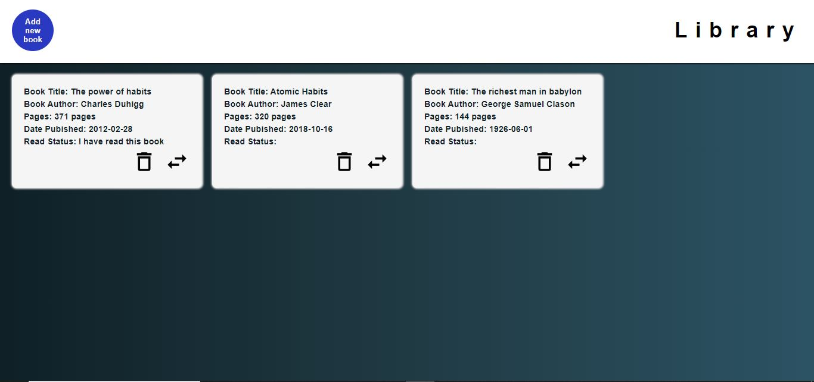

# odin_library_app

This is a solution to the [Library app on The Odin Project]

## Table of contents

- [Overview](#overview)
  - [Screenshot](#screenshot)
  - [Links](#links)
- [My process](#my-process)
  - [Built with](#built-with)
  - [What I learned](#what-i-learned)
- [Author](#author)

## Overview

### Screenshot

### Links

- Solution URL: [Click here](https://git@github.com:mayorr-star/odin_library_app.git)
- Live Site URL: [Click here](https://mayorr-star.github.io/odin_library_app/)

## My process

### Built with

- Semantic HTML5 markup
- CSS custom properties
- Flexbox
- CSS Grid
- JS Function Constructors

### What I learned

- Creating multiple objects using constructor funtions

## Author

- Twitter - [@His_mayorr](https://www.twitter.com/@His_mayorr)